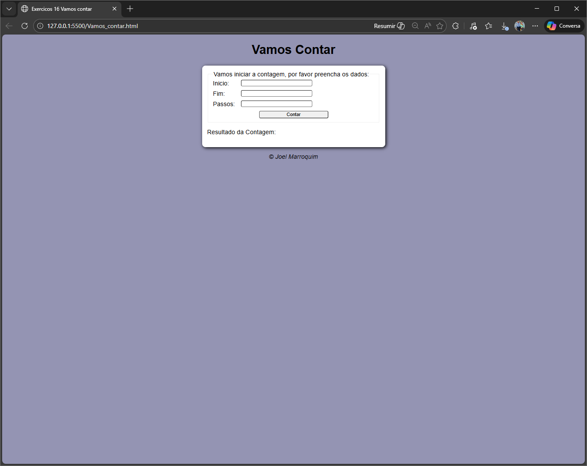
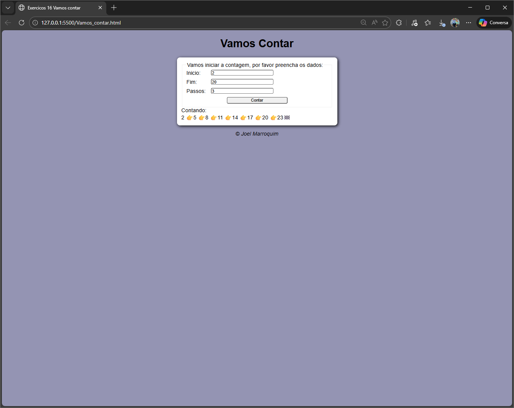

# Contador de Passos

Projeto desenvolvido durante meus estudos de JavaScript (Curso em Vídeo - Guanabara).

## 📌 Funcionalidade
Permite inserir:
- Número inicial
- Número final
- Passo

E realiza contagem crescente ou regressiva.

## 🛠 Tecnologias
- HTML
- CSS
- JavaScript

## 📚 Aprendizados
- Estrutura de repetição (for)
- Condições (if/else)
- Manipulação de DOM
- Conversão de tipos (Number)

## 📸 Preview

### 🔹 Tela Inicial

### 🔹 Resultado da Contagem

